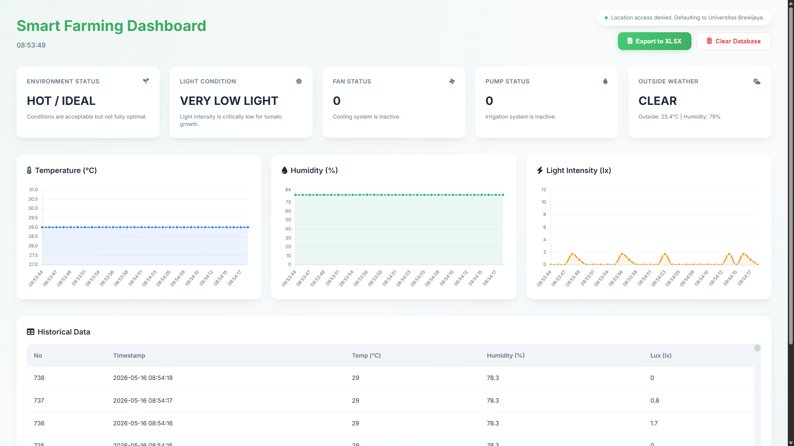

# PROYEK PROTOTIPE IoT/IIoT AGROINDUSTRI
## Implementasi Sistem Smart Greenhouse Tomat Berbasis IoT untuk Monitoring dan Pengendalian Lingkungan Secara Real-Time

**Mata Kuliah:** Agroindustri Cerdas (Dosen Pengampu: Mas'ud Effendi, STP., MP)
**Komoditas / Unit Proses:** Smart Greenhouse Tomat
**Program Studi / Kelas:** Teknologi Industri Pertanian / C

### 👥 Tim Penyusun
| Jabatan | Nama | NIM |
|:---:|:---|:---:|
| Anggota 1 | Ade Surya Ananda | 235100300111009 |
| Anggota 2 | Ardini Salwa Juwita | 235100301111010 |
| Anggota 3 | Faa'izah Alya Shakila Syamsi | 235100301111019 |
| Anggota 4 | Ibrahim Al Ghifari | 235100301111021 |
| Anggota 5 | Areta Nailahsyah | 235100301111034 |

---

# Sistem Monitoring dan Kontrol IoT untuk Rumah Kaca

Sistem berbasis Web IoT yang dirancang untuk memonitor dan mengontrol kondisi lingkungan rumah kaca secara otomatis. Sistem ini menggunakan ESP32 sebagai mikrokontroler, Flask sebagai backend server, dan database SQLite untuk penyimpanan data.



## 📋 Fitur Utama

### 1. Monitoring Real-time
- **Sensor Data**: Suhu (°C), Kelembaban (%), dan Intensitas Cahaya (Lux) dari sensor DHT22 dan BH1750.
- **Lokasi Otomatis**: Menggunakan GPS dari perangkat pengguna (HP/Laptop) untuk menandai lokasi pengambilan data.
- **Visualisasi**: Grafik interaktif menggunakan Chart.js untuk tren data historis.

### 2. Kontrol Otomatis (IoT Actuation)
- **Hysteresis Control**: Mencegah actuator sering menyala/mati (flutter) dengan menggunakan ambang batas ON dan OFF yang berbeda.
- **Fan**: Otomatis menyala jika suhu melebihi batas atas dan mati jika turun di bawah batas bawah.
- **Pump**: Otomatis menyala jika kelembaban di bawah batas minimum dan mati jika mencapai target.
- **Logging**: Semua perubahan status actuator dicatat lengkap dengan timestamp.

### 3. Manajemen Threshold
- **Web Interface**: Pengguna dapat mengubah nilai threshold (suhu ON/OFF, kelembaban ON/OFF) melalui halaman web.
- **Real-time Update**: Perubahan threshold langsung diterapkan pada ESP32 tanpa perlu flashing ulang.

### 4. Ekspor Data
- **Download Excel**: Data historis sensor dapat diunduh dalam format file Excel (.xlsx) untuk analisis lebih lanjut.

### 5. Konektivitas Jaringan
- **Auto-Reconnect**: ESP32 akan secara otomatis mencoba menyambung kembali ke WiFi jika koneksi terputus.
- **Fallback SSID**: Jika SSID utama gagal ditemukan, sistem akan mencari SSID alternatif yang terdaftar.

## 🛠️ Instalasi dan Setup

### Prerequisites
- Python 3.7+
- Node.js 18+
- Arduino IDE (untuk ESP32)

### Backend (Flask & Database)
1. Clone repository:
   ```bash
   git clone <repository-url>
   cd agrocer
   ```

2. Install dependencies:
   ```bash
   pip install -r requirements.txt
   ```

3. Jalankan server:
   ```bash
   flask run
   ```
   Server akan berjalan di `http://localhost:5000`.

### Frontend (Dashboard)
1. Install dependencies:
   ```bash
   cd static
   npm install
   ```

2. Jalankan dashboard:
   ```bash
   npm start
   ```
   Dashboard akan terbuka di `http://localhost:3000`.
   *Catatan: Pastikan frontend dapat mengakses backend (misal: ubah `serverURL` di `static/js/config.js` jika menggunakan port default Flask yang berbeda)*.

### Firmware (ESP32)
1. Install ESP32 board support di Arduino IDE.

2. Instal library yang diperlukan:
   - DHT sensor library
   - BH1750 library
   - ArduinoJson (jika digunakan)

3. Edit file `sketch_may14a/sketch_may14a.ino`:
   - Update `wifiSSIDs` dan `wifiPasswords` dengan kredensial WiFi Anda.
   - Update `serverURL` jika Anda menggunakan port Flask yang berbeda atau jika hosting di server sendiri.

4. Upload kode ke ESP32.

## 🔗 Cloudflare Tunnel (Opsional)
Untuk akses dari luar jaringan lokal, gunakan Cloudflare Tunnel:

1. Install `cloudflared` di server Anda (sesuai dokumentasi Cloudflare).
2. Jalankan tunnel:
   ```bash
   cloudflared tunnel --url http://localhost:5000
   ```

## 📜 Lisensi
MIT